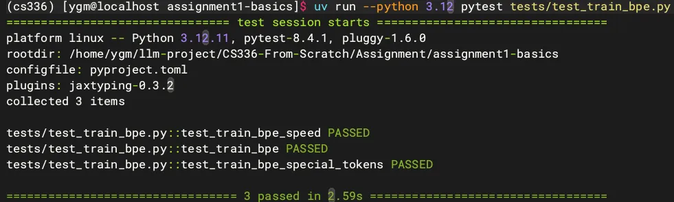

# 
 🚀🚀 CS336-From-Scratch Spring 2026🚀🚀 

> The NoteBook and Assignments implemention via Learning CS336 Spring 2026！

> “And in the end, the love you take is equal to the love you make.”  —— The Beatles

`I'm mungeryang, a master's student from the University of Chinese Academy of Sciences(UCAS-iie). In this Repo, I have open-sourced all of my study notes, implementation details for assignments, and results.`

  

Class HomePage：https://cs336.stanford.edu/

## 🧐100 $QA_{s}$ ON LLM - 大模型面试100问

> ### 通过整理 `Standford CS336 Spring26` 课堂笔记，总结大模型算法经典面试**100**问

## 💻 Assignments

### Assignment 1: Basics

- Implement all of the components (tokenizer, model architecture, optimizer) necessary to train a standard Transformer language model
- Train a minimal language model

|Assignment1|   Status   |  Link  |
| :-------: | :--------: | :----: |
| train_bpe |     ✅     |   [BPE Implementation](https://github.com/Mungeryang/CS336-From-Scratch-Spring2026/blob/main/Assignment/assignment1-basics/cs336_basics/train_bpe.py)   |
| BPETokenizer |  ✅     |   [Tiny_BPETokenizer Class Implementation](https://github.com/Mungeryang/CS336-From-Scratch-Spring2026/blob/main/Assignment/assignment1-basics/cs336_basics/train_bpe.py)    |
|  Linear   |    ✅      |[Linear Class](https://github.com/Mungeryang/CS336-From-Scratch-Spring2026/blob/main/Assignment/assignment1-basics/cs336_basics/linear.py)         |
| Emebdding |     ✅     | [EMbedding Class](https://github.com/Mungeryang/CS336-From-Scratch-Spring2026/blob/main/Assignment/assignment1-basics/cs336_basics/embedding.py)        |
| RMSNorm   |     ✅     | [RMSNorm](https://github.com/Mungeryang/CS336-From-Scratch-Spring2026/blob/main/Assignment/assignment1-basics/cs336_basics/rmsnorm.py)        |
| Swiglu    |     ✅     | [SwiGLU FFN](https://github.com/Mungeryang/CS336-From-Scratch-Spring2026/blob/main/Assignment/assignment1-basics/cs336_basics/swiglu.py)        |
| RoPE      |     ✅     | [RoPE Class](https://github.com/Mungeryang/CS336-From-Scratch-Spring2026/blob/main/Assignment/assignment1-basics/cs336_basics/rope.py)        |
| softmax   |     ✅     | [softmax funcion](https://github.com/Mungeryang/CS336-From-Scratch-Spring2026/blob/main/Assignment/assignment1-basics/cs336_basics/rope.py)        |
| attention |     ✅     | [Scaled_Dot_Attn](https://github.com/Mungeryang/CS336-From-Scratch-Spring2026/blob/main/Assignment/assignment1-basics/cs336_basics/scaled_dot_product_attention.py)        |
| mul-attn  |     ✅     | [MultiHeadAttn Class](https://github.com/Mungeryang/CS336-From-Scratch-Spring2026/blob/main/Assignment/assignment1-basics/cs336_basics/multihead_self_attention.py)        |
| LM block  |     ✅     | [Transformer Block](https://github.com/Mungeryang/CS336-From-Scratch-Spring2026/blob/main/Assignment/assignment1-basics/cs336_basics/transformer_block.py)       |
| cross-entropy |  ✅    | [train function](https://github.com/Mungeryang/CS336-From-Scratch-Spring2026/blob/main/Assignment/assignment1-basics/tests/adapters.py)        |
| AdamW     |  ✅        | [Adamw optimizer](https://github.com/Mungeryang/CS336-From-Scratch-Spring2026/blob/main/Assignment/assignment1-basics/cs336_basics/adamw.py)        |

### ⌨️ Assignment 1: Results

#### Test train_bpe

#### Test Tokenizer

#### Test Transformer_LM

#### Test Utils and Optimizer

#### Test DataLoader and Checkpoint

### Assignment 2: Systems

- Profile and benchmark the model and layers from Assignment 1 using advanced tools, optimize Attention with your own Triton implementation of FlashAttention2

- Build a memory-efficient, distributed version of the Assignment 1 model training code

### Assignment 3: Scaling

- Understand the function of each component of the Transformer
- Query a training API to fit a scaling law to project model scaling

### Assignment 4: Data

- Convert raw Common Crawl dumps into usable pretraining data
- Perform filtering and deduplication to improve model performance

### Assignment 5: Alignment

- Apply supervised finetuning and reinforcement learning to train LMs to reason when solving math problems
- **[Optional Part 2](https://github.com/stanford-cs336/assignment5-alignment/blob/main/cs336_spring2025_assignment5_supplement_safety_rlhf.pdf)**: implement and apply safety alignment methods such as DPO

